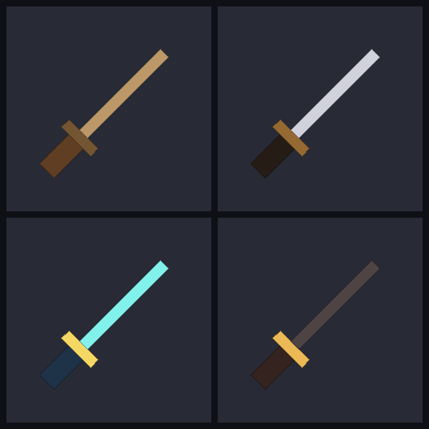

# MeetionRC 3D Katana Pack

Ресурспак, который заменяет 4 ванильных меча на **3D-катаны**:

| Item | → |
|------|----|
| `wooden_sword` | Бокен (деревянная катана) |
| `iron_sword` | Железная катана |
| `diamond_sword` | Алмазная катана с золотой цубой |
| `netherite_sword` | Незеритовая катана с золотой цубой |

Версии Minecraft: **1.20.1**, **1.21.5**, **1.21.8** (один пак — все три, через
`supported_formats: 15..64` в `pack.mcmeta`).



## Что внутри

Каждая катана = 3 настоящих 3D-кубоида (а не 2D-спрайт растянутый в глубину):

- **рукоять** (柄, _tsuka_) — 2×4×2 вокселя, обмотка-узор
- **гарда** (鍔, _tsuba_) — 4×1×4 вокселя, плоский диск
- **клинок** — 1×11×0.5 вокселей, длинный тонкий

Все три кубоида повёрнуты на −45° вокруг Z, чтобы катана лежала по диагонали
«рукоять снизу-слева → остриё сверху-справа» — это совпадает с ориентацией
ванильных мечей и ванильные `item/handheld` display-трансформы работают как
есть.

## Структура

```
katana-pack/
├── pack.mcmeta              # supported_formats 15..64
├── pack.png                 # иконка пака
├── assets/minecraft/
│   ├── models/item/
│   │   ├── wooden_sword.json       # 3D-модель бокена
│   │   ├── iron_sword.json
│   │   ├── diamond_sword.json
│   │   └── netherite_sword.json
│   ├── textures/item/
│   │   ├── wooden_sword.png        # 16×32 UV-атлас
│   │   ├── iron_sword.png
│   │   ├── diamond_sword.png
│   │   └── netherite_sword.png
│   └── items/                       # 1.21.4+ items definitions
│       ├── wooden_sword.json
│       ├── iron_sword.json
│       ├── diamond_sword.json
│       └── netherite_sword.json
└── tools/
    ├── generate.py          # ← перегенерирует все JSON и PNG
    ├── preview.py           # рисует превью текстур и wireframe
    └── preview_filled.py    # рисует превью с заливкой (как сверху)
```

## Установка

1. Заархивируй папку `katana-pack/` в `katana-pack.zip` (внутри zip-архива
   на верхнем уровне должны лежать `pack.mcmeta` и `assets/`, а не папка
   `katana-pack/`).
2. Перенеси zip в `.minecraft/resourcepacks/`.
3. В игре: **Options → Resource Packs → Available** → стрелочка вправо у
   `MeetionRC 3D Katanas` → **Done**.

## Кастомизация

Открой `tools/generate.py` — секция `SCHEMES` в начале файла задаёт цвета
каждой катаны. Поменял RGB — запустил `python3 tools/generate.py` —
текстуры и модели перегенерились.

Если хочешь поменять геометрию (например, сделать клинок длиннее или цубу
шире), редактируй `make_model()` ниже в этом же файле — `from`/`to` для
каждого кубоида.

## Технические заметки

- **Формат пака**: `pack_format: 15` + `supported_formats: {15..64}`. На 1.20.x
  Minecraft использует `pack_format`, на 1.21.x — `supported_formats`. Один
  ресурспак работает на всех трёх версиях.
- **`assets/minecraft/items/*.json`** — нужны только начиная с 1.21.4 (новая
  система рендера предметов). На 1.20.1 эти файлы просто игнорируются.
  В них стоит редирект на ту же модель `minecraft:item/<name>_sword`.
- **UV-атлас**: 16×32 PNG. Каждой грани кубоида в JSON прописан свой `uv`-регион.
  `texture_size: [16, 32]` сообщает Minecraft масштаб атласа.
- **Чем заменять не вышло**: enchanted-glint (свечение от чар) Minecraft
  применяет к модели автоматически, ничего настраивать не нужно — будет
  работать с этими 3D-катанами.
